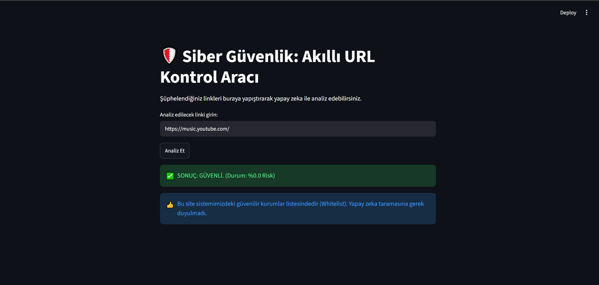
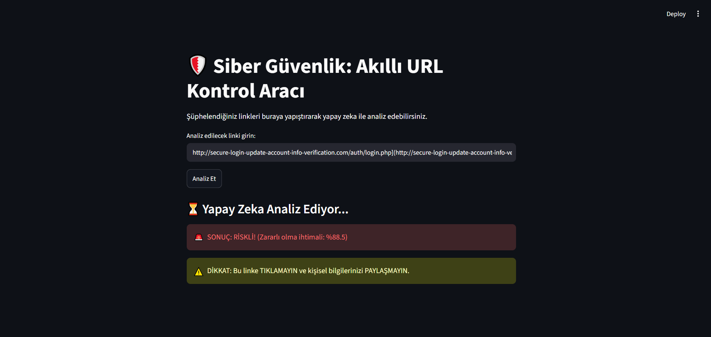

# 🛡️ FraudShieldAI: Akıllı URL Kontrol Aracı

Bu proje, ham veriden web arayüzüne kadar uzanan **uçtan uca bir Makine Öğrenmesi (Machine Learning) boru hattı (pipeline)** çalışmasıdır. Doğal Dil İşleme (NLP) teknikleri kullanılarak, kullanıcıları oltalama (phishing) sitelerinden korumak amacıyla geliştirilmiştir.

## 📌 Problem Tanımı ve Amaç

Siber güvenlik dünyasında en yaygın saldırı vektörlerinden biri oltalama (phishing) linkleridir. Bu projenin amacı; bir URL'nin yapısal ve anlamsal özelliklerini analiz ederek, hedeflenen sitenin güvenli (0) veya zararlı (1) olduğunu makine öğrenmesi algoritmalarıyla gerçek zamanlı olarak tahmin etmektir.

## 📊 Veri Toplama ve Keşifçi Veri Analizi (EDA)

Projede Kaggle üzerinden sağlanan **651.191 satırlık** gerçek dünya URL veri seti kullanılmıştır.

* **Özellik (X):** Ham URL metinleri
* **Hedef (y):** Sınıflandırma (Normal: 0, Zararlı: 1)
* **Dağılım:** Veri seti dengesiz (imbalanced) olup, çoğunluk sınıfı güvenli sitelerden oluşmaktadır. Keşifçi veri analizi sürecinde veri temizlenmiş ve sınıf dağılımları Matplotlib ile görselleştirilmiştir.

## ⚙️ Metodoloji ve Model Eğitimi

URL'ler sadece karakter sayısına göre değil, içerdikleri kelimelerin anlamsal önemine göre analiz edilmiştir.

1. **Doğal Dil İşleme (NLP):** `TfidfVectorizer` kullanılarak URL içindeki anlamlı 3000 kelime/parça matematiksel bir vektör matrisine dönüştürülmüştür.
2. **Model Seçimi:** Yüksek boyutlu seyrek (sparse) matrislerdeki hızı ve başarısı nedeniyle **Logistic Regression** tercih edilmiştir. Veri %80 Eğitim, %20 Test olarak ayrılmıştır.

## 📈 Sonuçlar ve Performans Değerlendirmesi

Geliştirilen NLP modeli test verisi üzerinde **%94 Doğruluk (Accuracy)** oranına ulaşmıştır. Siber güvenlik için en kritik metrik olan zararlı siteleri yakalama oranı (Fraud Recall) ise %86 olarak ölçülmüştür.

### 🧠 Modelin Zayıf Yönleri ve Mühendislik Çözümleri

Gerçek dünya senaryolarıyla yapılan canlı testlerde (Inference) şu bulgular elde edilmiştir:

* **Veri Yanlılığı (Data Bias):** Eğitim verisinde çok fazla sahte "apple" veya "youtube" linki bulunduğu için, model bu kelimeleri doğrudan tehdit olarak algılayıp orijinal sitelere False Positive uyarısı vermiştir.
* **Ele Geçirilmiş Alan Adları (Compromised Domains):** Başlangıcı masum görünen ancak alt dizinlerine oltalama dosyaları saklanmış hacklenmiş sitelerde model URL'nin başındaki masumiyete aldanarak False Negative üretmiştir.
* **Çözüm (Whitelist Mimarisi):** Bu algoritmik önyargıları aşmak için Streamlit web arayüzüne kural tabanlı bir **Beyaz Liste (Whitelist)** mekanizması entegre edilmiştir. Bilinen güvenilir kök alan adları (google, youtube, github, edu.tr uzantıları vb.) yapay zekaya sokulmadan doğrudan onaylanmaktadır.

## 💻 Uygulama Arayüzü (Ekran Görüntüleri)

**1. Güvenli Site Analizi (Whitelist Devrede):**



**2. Şüpheli Site Analizi (Yapay Zeka Devrede):**



## 🚀 Kurulum ve Çalıştırma

Projedeki Akıllı URL Kontrol Aracı, `Streamlit` kullanılarak bir web uygulaması haline getirilmiştir. Kendi bilgisayarınızda çalıştırmak için:

1. Gerekli kütüphaneleri yükleyin:

```bash
pip install pandas scikit-learn matplotlib streamlit joblib
```

1. Web arayüzünü başlatın:

```bash
streamlit run app.py
